### 실 데이터 호환 코드 생성

실데이터 JSON을 그대로 쓰려면, 먼저 우리 환경(env)에서 요구하는 형식의 JSON으로 변환해야 합니다. env JSON은 facility group 단위의 정의를 기본으로 하고, 각 그룹의 footprint(가로/세로), clearance(여백), 제약 필드(높이/무게/dry 등) 같은 값들이 정해진 스키마로 들어가야 합니다. 그래서 실데이터를 변환할 때는 설비들을 그룹 단위로 묶고, 그룹의 최종 모양(행/열 배열 등)을 확정한 뒤, 그 결과를 env JSON 스펙에 맞춰 채워 넣는 방식으로 처리했습니다. 변환 로직은 기본적으로 제공된 노트북의 파이썬 변환 코드를 기준으로 따라갔습니다.

먼저 같은 타입의 설비들을 하나의 그룹으로 묶습니다. 각 그룹의 clearance는 areaMap의 VARIABLE_AREA에서 추출하되, dock과 storage 타입은 0으로 처리합니다. 입출구가 설비 가장자리에 있으면 해당 방향에 통로 폭을 반영합니다.

그룹 내 설비들은 일단 일렬로 배열합니다. 공장 크기에 비해 너무 길면 행이나 열을 늘려서 분산시킵니다. 이때 설비 수량에 따라 여백을 줄이는 buffer 로직을 적용합니다. 세로로 긴 배열이면 좌우 여백을, 가로로 긴 배열이면 상하 여백을 줄입니다. 같은 타입 설비들이 붙어 배치될 때 중복 여백을 줄이기 위함입니다.

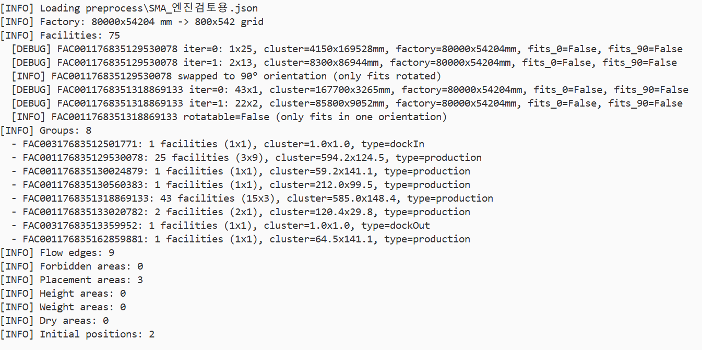

제약 조건은 높이/무게/dry 등을 설비 속성에서 가져옵니다. 단, storage 타입은 높이 제약을 설정하지 않습니다.

변환을 마친 뒤에는 실제로 env에 JSON을 로드해서, 각 그룹이 실제로 배치 가능한 위치가 최소 1개 이상 존재하는지를 검사합니다. 만약 배치 불가능한 그룹이 발생하면, 해당 그룹의 행/열 배열을 다시 조정해 footprint와 clearance를 재계산한 다음 다시 검사합니다. 이 배치 가능성 검사는 많은 위치를 빠르게 확인해야 하므로, conv2d 기반의 병렬 처리로 효율적으로 수행합니다.

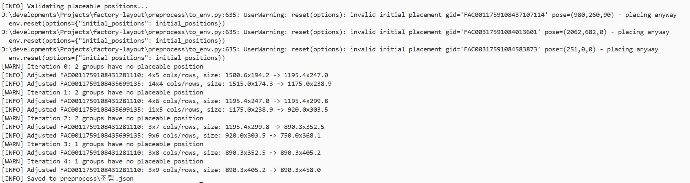

## 배치 결과

배치 결과는 다음과 같습니다. 먼저 동적 배치 대상(예: storage 등)은 기존 배치 환경과의 호환성을 유지하기 위해, 임시로 정적 그룹 형태로 변환하여 배치를 수행했습니다. 초기 배치는 충돌(겹침) 및 zone 제약을 적용하지 않은 상태에서 진행했습니다. 이 때문에 일부 설비가 서로 겹치는 사례가 확인되었는데, 해당 결과가 잘못되었다면 초기 배치 코드를 수정해서 다시 적용하도록 하겠습니다. 

### SMA

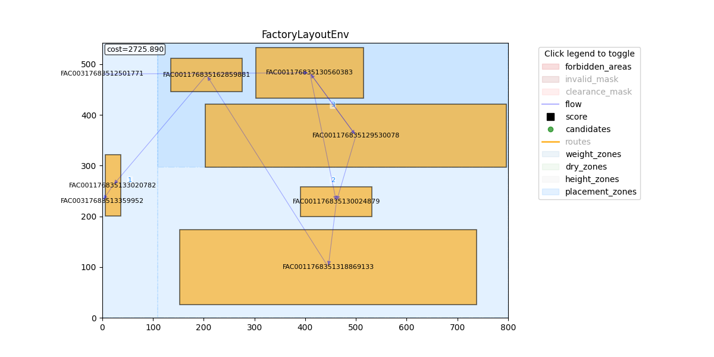

### 전극

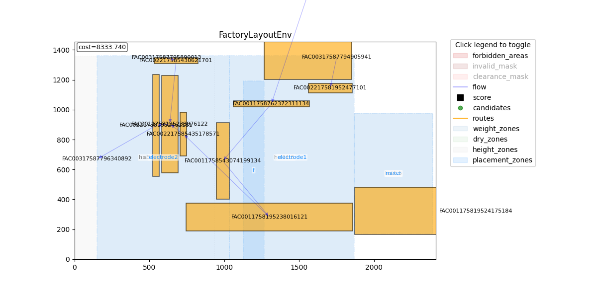

### 활성화
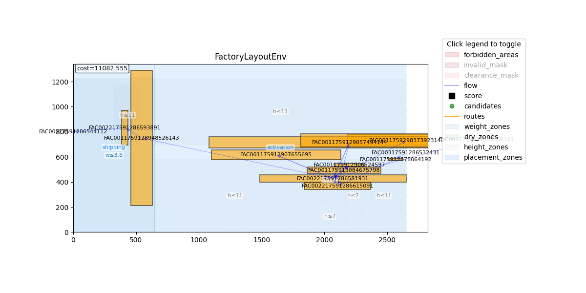

## postprocessing 과정 추가

Postprocessing은 모든 배치가 완료된 이후 최종 결과를 기반으로 추가 계산을 수행하는 단계입니다. 먼저 물류 동선 평가를 위해 pathfinding을 적용하는데, 이를 배치 과정의 매 step마다 수행하면 전체 실행 시간이 과도하게 늘어나 배치 탐색 자체가 비효율적이 됩니다. 따라서 배치가 모두 완료된 뒤 최종 결과를 대상으로 pathfinding을 한 번에 수행하도록 postprocessing 단계로 분리했습니다. 다음으로 동적 그룹 배치는 직사각형 고정 배치와 달리 다양한 모양으로 유동적으로 형상을 만들어가며 배치하는 과정이므로, 기존 task의 가정과 크게 달라 기존 agent 파이프라인에 그대로 통합하기 어려웠습니다. 이에 동적 그룹 배치 역시 postprocessing 단계에서 별도의 절차로 처리했습니다.

### pathfinding 알고리즘 추가

배치 완료 후 설비 간 물류 동선을 다익스트라(Dijkstra) 알고리즘으로 계산합니다. 경로는 clearance 영역은 통과할 수 있지만, 설비 본체와 금지 영역은 회피하도록 설정했습니다. 다익스트라는 병렬화가 어렵고 계산 비용이 높기 때문에 매 step마다 호출하지 않고, episode 종료 후 한 번만 수행합니다.

또한 회전 후보를 확장했습니다. 0°/180°, 90°/270°는 설비 외형은 동일하고 입·출구 위치만 달라지는 케이스이므로, 기존에는 0°/90°만 후보로 생성하던 방식에서 180°/270°도 함께 평가하도록 변경했습니다. 점수 계산은 L1(맨해튼) 거리 기반이라 계산이 단순하고 선형적이어서, 여러 회전 후보의 점수를 병렬로 계산한 뒤 최적 회전을 선택할 수 있습니다.

| 180°/270° 회전 미지원                              | 180°/270° 회전 지원                             |
| --------------------------------------------- | ------------------------------------------- |
|  |  |

실험 결과, 180°/270° 회전 후보를 추가해도 전체 결과에는 큰 차이가 없었습니다. 이번 조건에서는 180°/270° 회전이 불가능하더라도 기존 알고리즘이 배치를 안정적으로 완료했고, 물류 동선 관점에서도 충분히 좋은 해를 찾는 것을 확인했습니다.

다만, 입출구 방향이 경로의 존재 가능성 또는 동선 비용에 크게 영향을 주는 문제에서는 180°/270° 미지원이 병목이 될 수 있습니다. 예를 들어 통로가 편향되어 특정 방향 접근이 사실상 강제되는 경우에는, 0°/90°만 허용하면 유효 경로가 크게 돌아가거나 특정 설비 쌍의 동선 비용이 과도하게 커질 수 있습니다. 따라서 해당 기능은 토글 옵션으로 유지하여, 케이스에 따라 활성화해 성능 저하 원인을 분리하고 필요 시 개선할 수 있도록 했습니다.

### Dynamic group 추가

동적 그룹은 동일한 unit을 반복 배치하여 하나의 큰 영역을 채우는 기능입니다. 예를 들어 8x20 크기의 unit에 좌우 2셀, 상하 3셀의 clearance가 필요하다면, 이를 반복 배치해서 목표 면적 혹은 부피를를 채우는 방식입니다.

배치 가능 위치 탐색에는 conv2d를 활용합니다. block 크기(unit + 2*clearance)의 커널을 valid 맵에 적용하면, 각 위치에서 block 영역 내 유효 셀 수를 한 번에 계산할 수 있습니다. 결과값이 block 전체 셀 수와 같으면 해당 위치에 배치 가능합니다. 

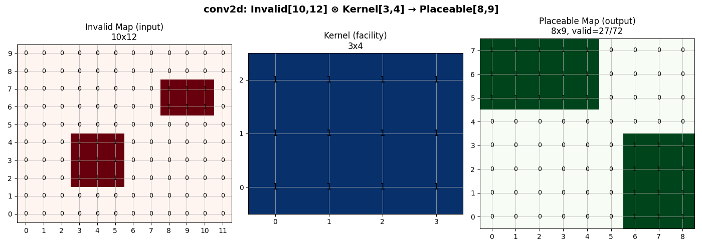

stride는 이 커널을 valid 맵 위에서 얼마나 건너뛰며 이동시키는지 정하는 간격이며, 가로 방향과 세로 방향을 서로 다르게 설정할 수 있습니다. 예를 들어 가로 stride를 unit 너비로 설정하면 가로 방향으로는 unit들이 연속적으로 붙어 배치되어 공간을 촘촘히 채울 수 있고, 세로 stride를 unit 높이에 clearance를 더한 값으로 설정하면 세로 방향으로는 unit 사이에 간격이 생겨 필수 통로를 유지할 수 있습니다.

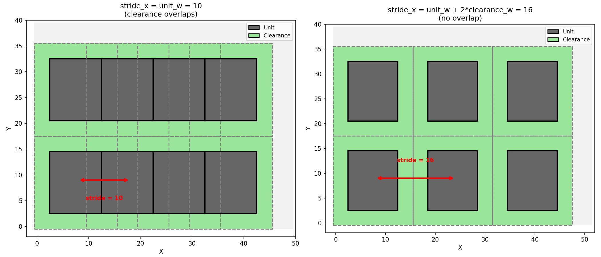

배치 순서는 cost 기반으로 결정합니다. 배치 가능한 후보 지점들에 대해 비용 증가분을 병렬로 추정하여 각 지점에 배치했을 때의 물류 비용 증가분을 계산하고, cost가 낮은 위치부터 우선적으로 채워갑니다. 이 방식으로 물류 동선 관점에서 유리한 위치부터 배치가 진행됩니다.

배치 과정 예시는 다음과 같습니다. 
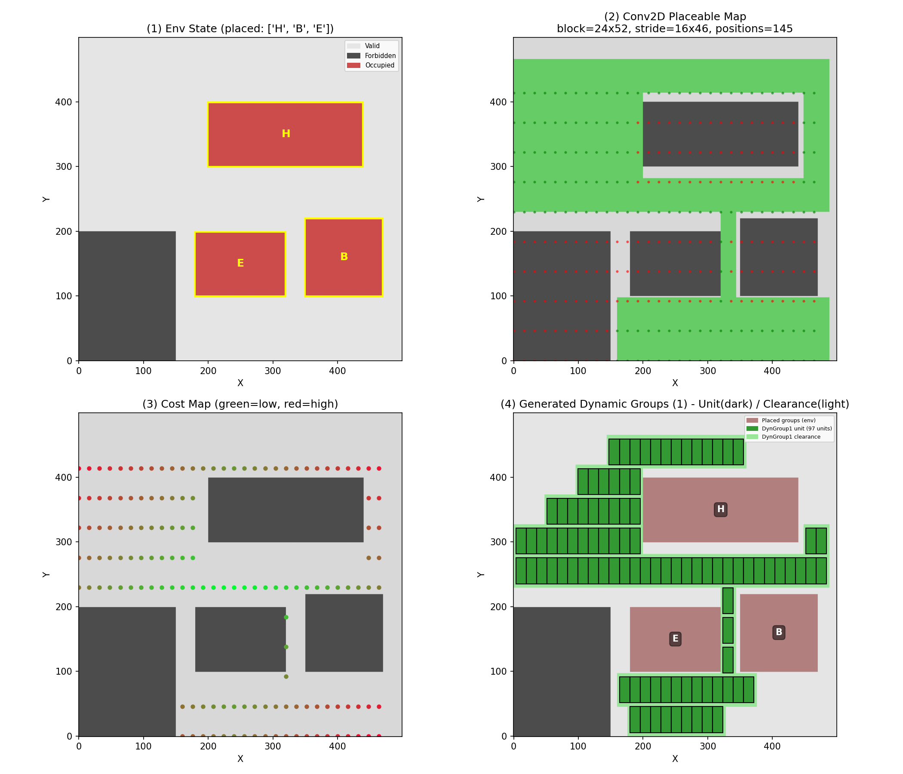

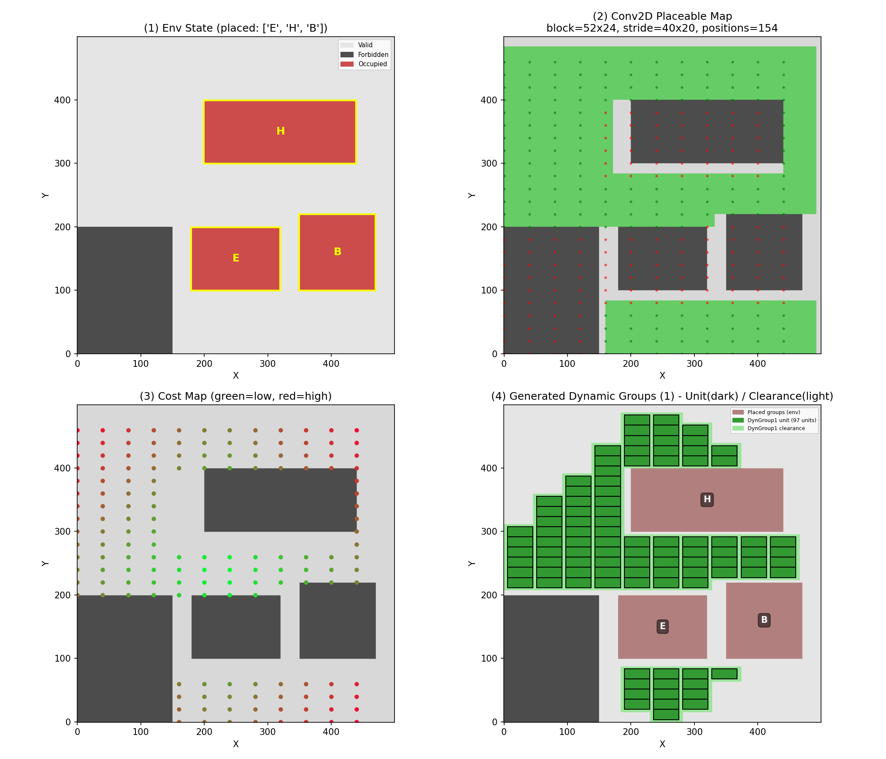

하지만 stride를 고정한 채로 탐색하면 두 가지 문제가 발생할 수 있습니다. 첫째, 회전에 따라 unit의 가로·세로가 바뀌는데도 stride가 일정하면 회전된 unit들이 그리드 상에서 동일한 기준으로 정렬되지 않아 배치 정합성이 깨질 수 있습니다. 둘째, 탐색을 stride 간격으로만 수행하면 그 사이 구간을 확인하지 못해 더 촘촘하게 배치할 수 있는 위치를 놓치는 경우가 생깁니다.

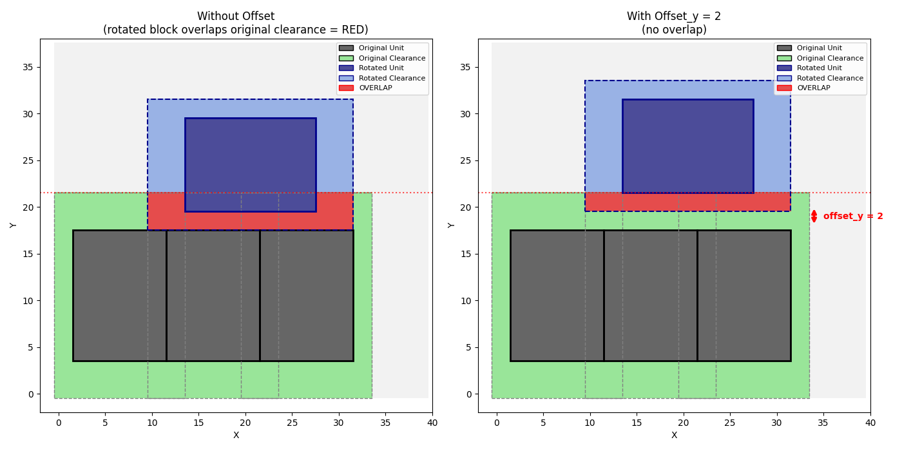

이를 해결하기 위해 dynamic storage에서는 시작점을 기준으로 인접 셀 단위로 확장하며 배치가 진행되도록 구성했습니다. 즉, 시작점(x, y, rot)에서 BFS로 유효 공간을 따라가며 unit을 순차적으로 이어 붙이기 때문에, stride 간격 때문에 생기는 후보 누락 없이 연속적인 격자 위치에서 촘촘한 배치가 가능합니다. 또한 회전에 따라 unit의 가로/세로가 바뀌는 경우에는 stride의 가로/세로도 함께 swap하여 회전된 unit들도 그리드 상에서 올바르게 정렬되도록 했습니다.

이 로직은 기존 agent + search 파이프라인의 흐름을 유지한 채 배치 실행 단계만 교체하는 방식으로 통합했습니다. 기존에는 선택된 (x, y, rot) 위치에 그룹을 정해진 형태로 그대로 배치했지만, dynamic storage에서는 동일한 입력(시작점)을 받아 해당 지점에서 BFS 확장을 수행해 unit을 순차적으로 배치합니다. 확장 과정의 배치 가능 판정은 기존과 동일하게 conv2d 기반 로직을 사용하되, 판정 대상이 단일 고정 그룹이 아니라 확장 중인 unit 배치로 바뀌도록 구성했습니다.

이렇게 하면 여러 storage group을 배치할 수 있습니다. 또한 step에서 배치할 unit 개수를 제한할 수 있어서, 공간이 부족하거나 일정 개수를 채우면 멈추고 남은 cell은 다음 step에서 새로운 시작점을 선택해 이어갑니다. 다음 시작점이 이전 배치와 붙어있으면 하나의 덩어리가 되고, 떨어져 있으면 별개의 덩어리가 됩니다.

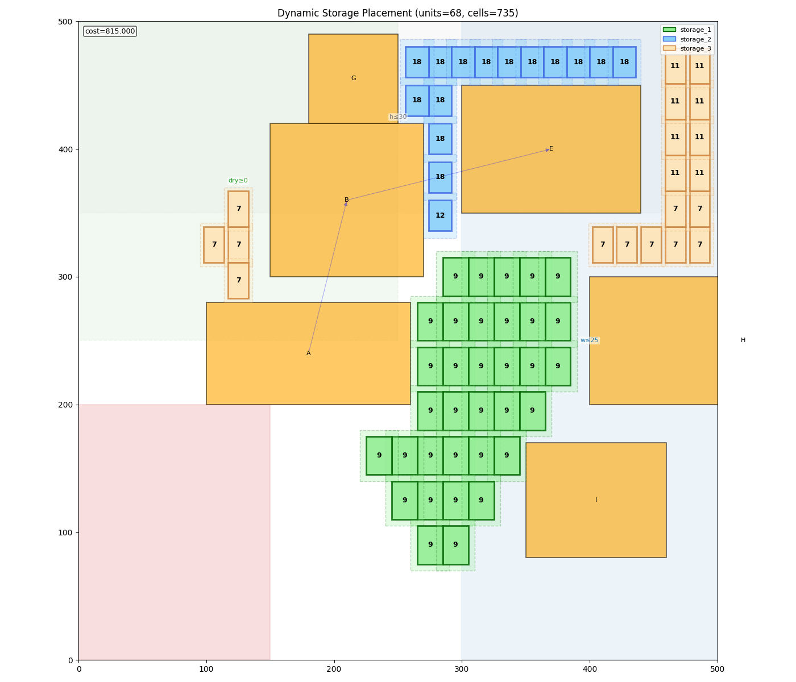

## Web UI 제작

지금까지 구현한 배치/탐색 로직을 사용자가 웹에서 실시간으로 상호작용하며 실행하고, 탐색 과정(후보 선택, 평가, 배치 진행 상황 등)을 시각적으로 확인할 수 있도록 Web UI를 제작했습니다. 사용자는 입력 파라미터를 조정하고, 배치 결과와 중간 과정을 단계별로 탐색하며, 주요 지표(비용, 제약 위반 여부, 진행률 등)를 함께 확인할 수 있습니다.

기본적인 레이아웃은 다음과 같습니다.

| 구분 | 이미지 |
|---|---|
| Light mode | 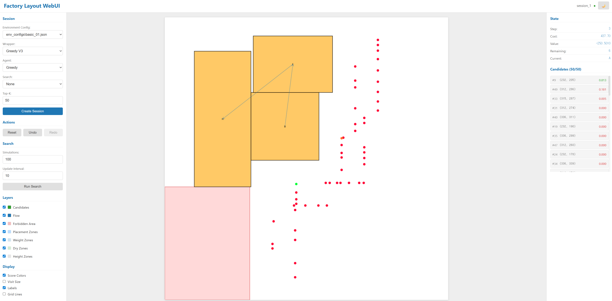 |
| Dark mode | 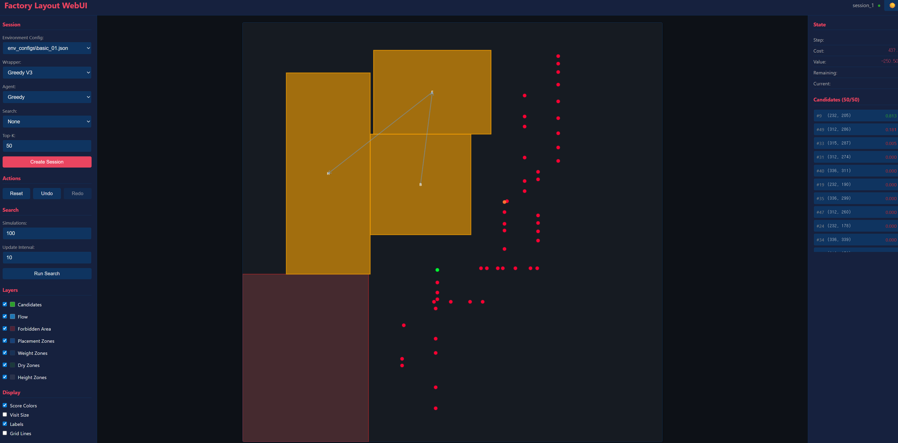 |

첫 세션을 시작하면 화면 좌측에서 env, agent, wrapper, search mode를 선택할 수 있습니다. 현재 env는 서버에 등록된 환경만 선택 가능하며, env 파일(JSON 형식) 업로드 기능은 추후 필요 시 추가 구현할 예정입니다.

| 항목 | 이미지 |
|---|---|
| Env 선택 | 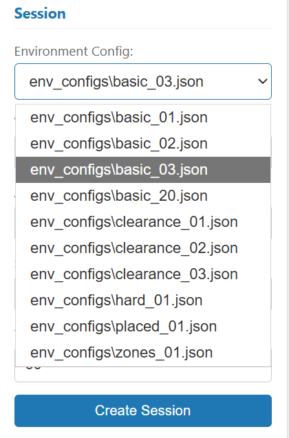 |
| Agent 선택 | 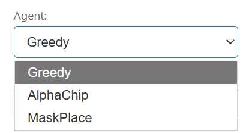 |

선택한 옵션에 대한 세부 설정(parameter)은 화면 우측 설정 창에서 조정할 수 있습니다.

| 항목 | 이미지 |
|---|---|
| Parameter 설정 | 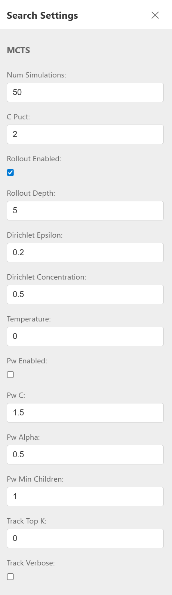 |

이와 같은 설정을 마친 뒤 Session Start를 누르면, 선택한 설정을 기준으로 세션이 시작됩니다.

### Search 기능

Search 알고리즘(MCTS, Beam Search)을 선택하면 탐색 기능을 사용할 수 있습니다. Run Search 버튼을 누르면 탐색이 시작되고, 레이아웃 화면과 Candidate 목록에 실시간으로 결과가 업데이트됩니다.

**레이아웃 화면:**
- 탐색 전: Prior(P) 기반 색상 표시 (모든 유효 후보)
- 탐색 후: Q-value 기반 색상 표시 (탐색된 후보만)
- 초록색에 가까울수록 유망한 좌표

**Candidate 목록:**

| 컬럼 | 설명 |
|------|------|
| Q | Q-value. 탐색을 통해 평가된 기대 가치. 높을수록 좋은 배치 |
| P | Prior. 탐색 전 휴리스틱 기반 초기 점수 |
| N | Visits. 해당 후보가 탐색에서 방문된 횟수. 많이 방문될수록 신뢰도 높음 |

컬럼 헤더를 클릭하면 해당 기준으로 정렬할 수 있으며, 값이 없는 항목(N/A)은 항상 맨 아래에 표시됩니다.

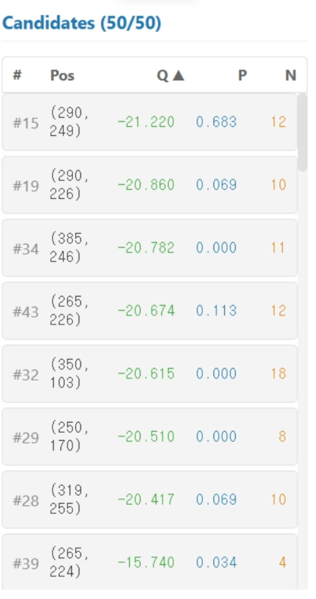

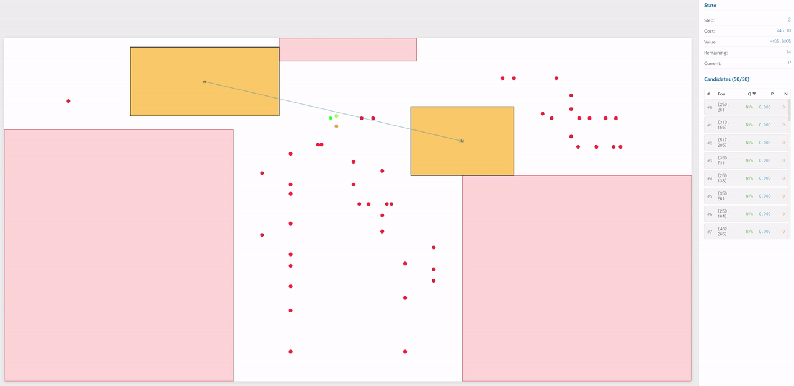

